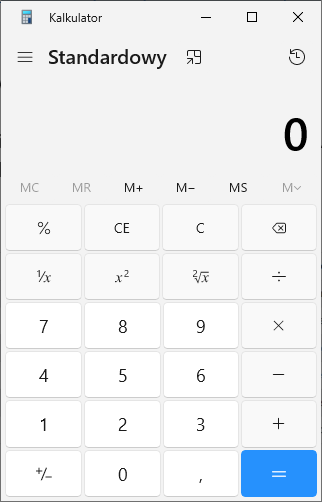

# A simple calculator implementation done in .net C# and avalonia mvvm as my university assignment. 

## Task description (in polish, written by the teacher)

>### Tworzymy aplikację okienkową kalkulator:
>
> 
>### Podstawowa implementacja (na 4.0):
>Aplikacja ma wykonywać podstawowe działania + - * \.
>Przyciski numeryczne mają być obsługiwane przez jedną funkcję (jeden kod).
>Przyciski z operacjami (=/-, , , = , <- , CE, C ) mają być obsługiwane przez jedną funkcję (jeden kod).
> 
>### Dla wytrwałych (na 5.0):
>Do zaimplementowania pozostałe funkcjonalności z obrazka.
